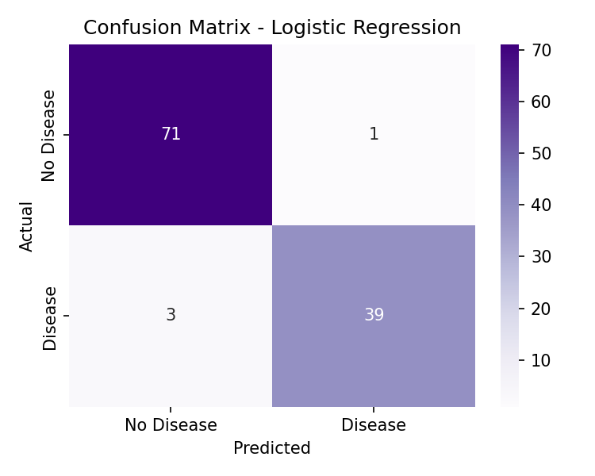

# 🩺 Disease Prediction from Medical Data

**Classifying cancer diagnoses from cell measurements — four models compared, 97% accuracy, and a live risk-assessment demo.**


---

## Why this project?

Early cancer detection is one of the highest-leverage places machine learning touches real lives. This project trains and benchmarks four classification algorithms on real diagnostic cell-nuclei measurements, then wraps the winner in an interactive web tool that turns ten raw numbers into a clear risk read in real time.

## 🎥 Try it live

Enter ten diagnostic measurements and get an instant risk assessment, backed by real probability scores — not a black box.

```
📁 webapp/   ← run this locally to try it in your browser
```

<p align="center">
  <em>Enter cell measurements → get an instant risk verdict with a full probability breakdown.</em>
</p>

## 📊 Results

Four models, evaluated on held-out test data:

| Model | Accuracy | Precision | Recall | F1-Score | ROC-AUC |
|---|---|---|---|---|---|
| **Logistic Regression** ⭐ | 96.49% | 0.975 | 0.929 | 0.951 | **0.9960** |
| Random Forest | 97.37% | 1.000 | 0.929 | 0.963 | 0.9944 |
| SVM (RBF) | 97.37% | 1.000 | 0.929 | 0.963 | 0.9947 |
| XGBoost | 97.37% | 1.000 | 0.929 | 0.963 | 0.9934 |

Every model clears 96%+ accuracy — the diagnostic signal in this data is strong, and **Logistic Regression edges out the field on ROC-AUC** despite being the simplest model on the list.



## 🧠 What's under the hood

- **Real clinical data** — the Breast Cancer Wisconsin (Diagnostic) dataset, a benchmark used across the medical ML literature
- **Four-way model bake-off** — Logistic Regression, Random Forest, SVM, and XGBoost, so the "best" model isn't just assumed
- **Feature importance analysis** — surfaces which cell measurements actually drive the diagnosis, not just the final label

## 🛠 Tech Stack

`Python` · `pandas` · `NumPy` · `scikit-learn` · `XGBoost` · `matplotlib` · `seaborn` · `Flask` · `HTML/CSS/JS`

## 🚀 Quick Start

**Run the analysis:**
```bash
pip install -r requirements.txt
python disease_prediction.py
```

**Try the live web demo:**
```bash
cd webapp
pip install -r requirements.txt
python train_model.py
python app.py
```
Open `http://localhost:5001` and start entering measurements.

## 📁 Structure

```
├── disease_prediction.py       # training & evaluation pipeline
├── requirements.txt
├── confusion_matrix.png        # generated on run
├── feature_importance.png      # generated on run
└── webapp/                     # interactive Flask demo
    ├── app.py
    ├── train_model.py
    └── templates/ · static/
```

## 🔮 What's next

- Extend to multi-disease classification (heart disease, diabetes) using the same pipeline
- Add SHAP values so every prediction shows exactly which measurements pushed it toward "high risk"
- Cross-validate across multiple hospital datasets to test generalization beyond one source

---

⚠️ **Educational project** — trained on public research data, not a substitute for professional medical diagnosis.

⭐ If this was useful or interesting, a star helps more people find it.
